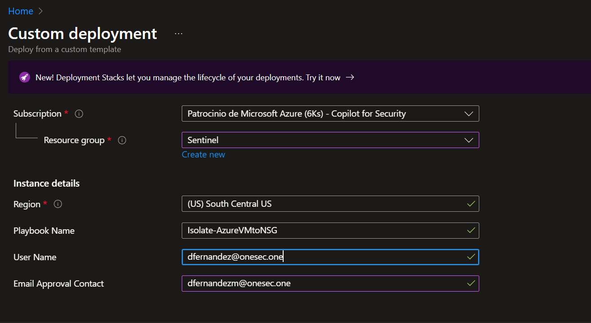
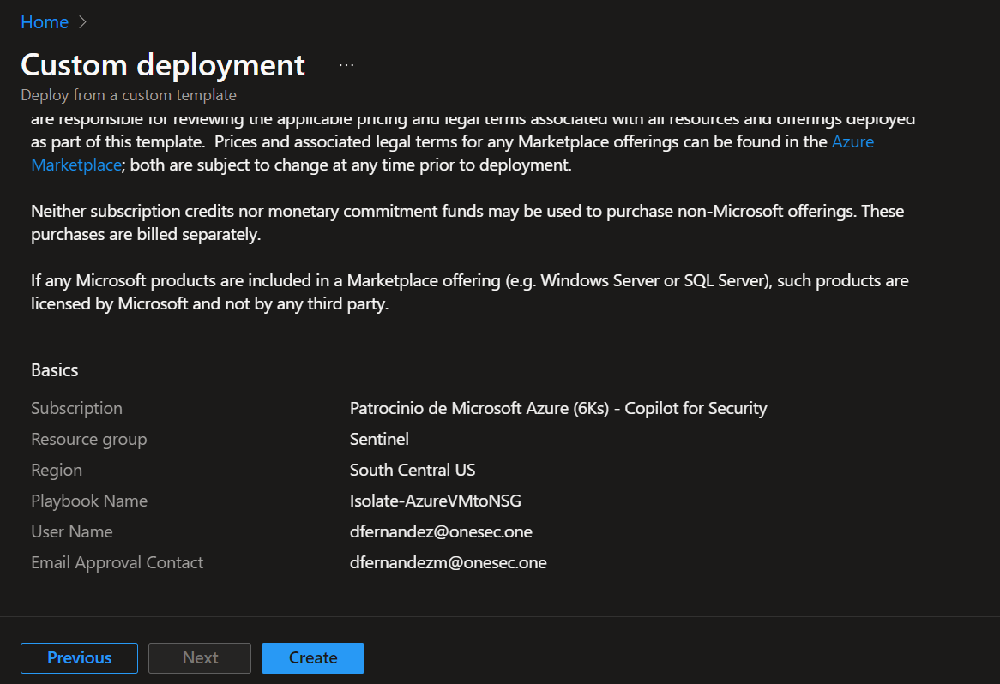
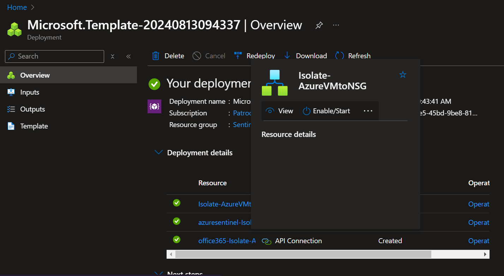
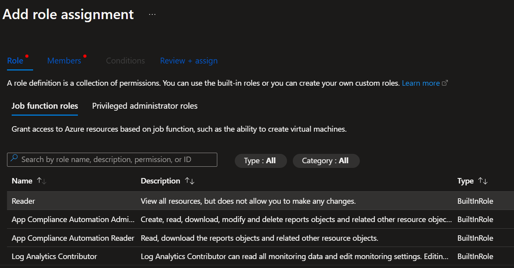
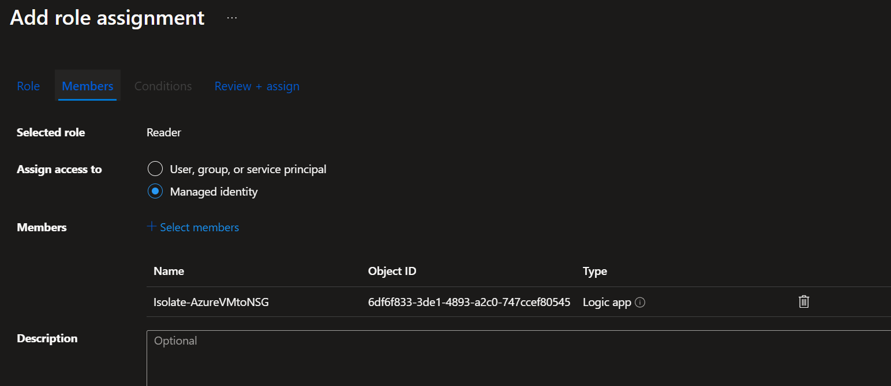

# Isolate-AzureVMtoNSG

En caso de presentar alguna duda, por favor, ponerse en contacto con dfernandezm@onesec.mx

Este manual tomará las entidades host del incidente desencadenado y buscará coincidencias en las suscripciones de las empresas. Se enviará un correo electrónico de aprobación para aislar la máquina virtual de Azure. Tras la aprobación, se crea un nuevo grupo de seguridad denegado (NSG Deny All) y se aplica a la máquina virtual de Azure. La máquina virtual de Azure se reinicia para eliminar todas las conexiones persistentes.

#### Despliegue

Agregue la información requerida en los espacios de user, email 
[]

Luego haga click en create

[]

En el despligue podrá observar los recursos creados

[]

#### Pasos adicionales posteriores a la instalación:

La aplicación lógica crea y usa una identidad de sistema administrada (MSI) para buscar en Azure Resource Graph, generar un NSG, actualizar la VM con NSG y reiniciar la VM.

Asigne la función *'Reader'*, *'Network Contributor'* y *'Virtual Machine Contributor*' de RBAC a la aplicación lógica en el nivel del grupo de NSG

[]

En la asignación del rol escoja identidad administrada y busque la logic app creada. 

[]

Luego revise que en su logic app las conexiones sean las correctas.

