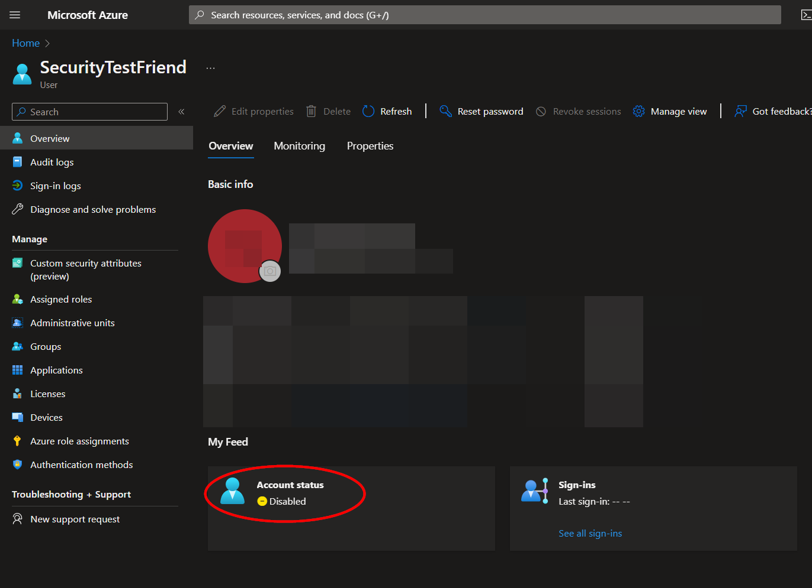
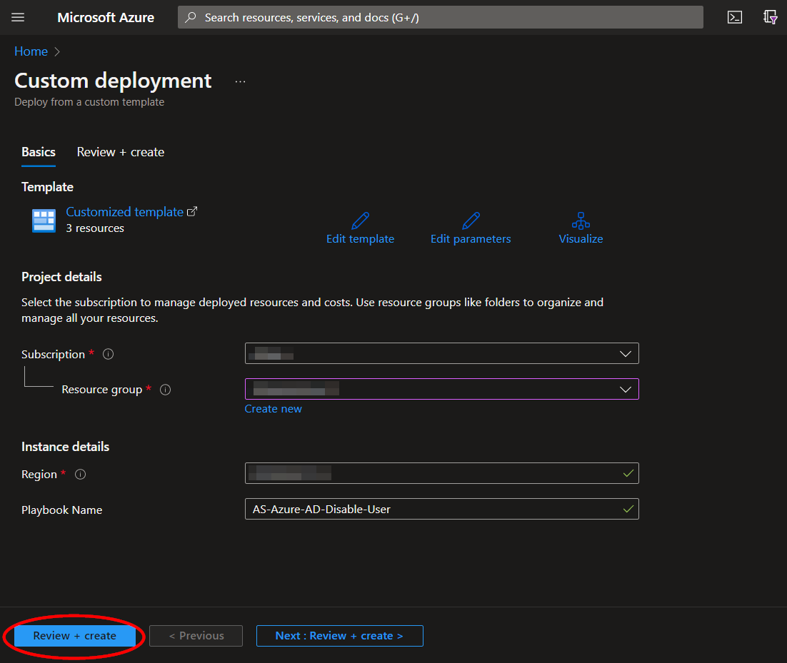
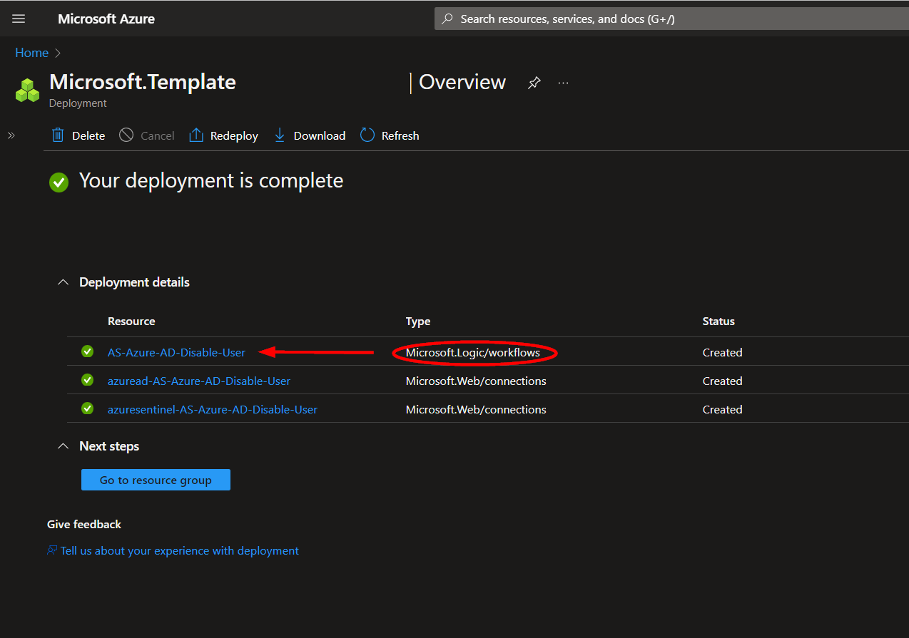
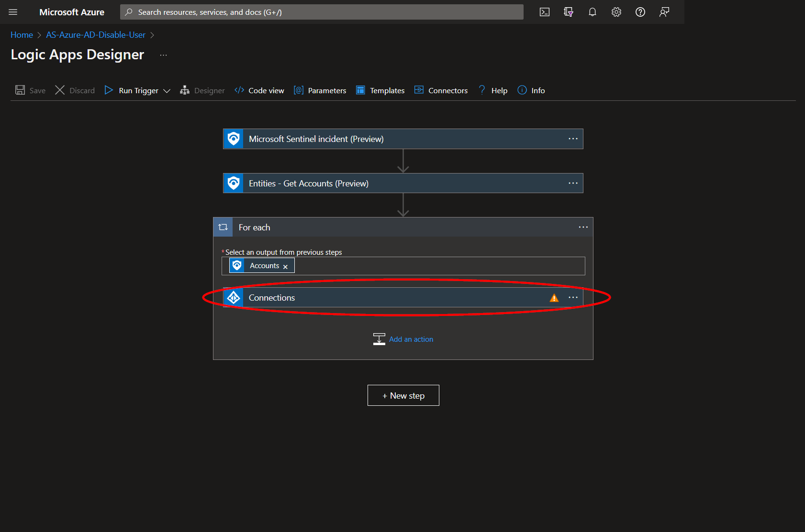
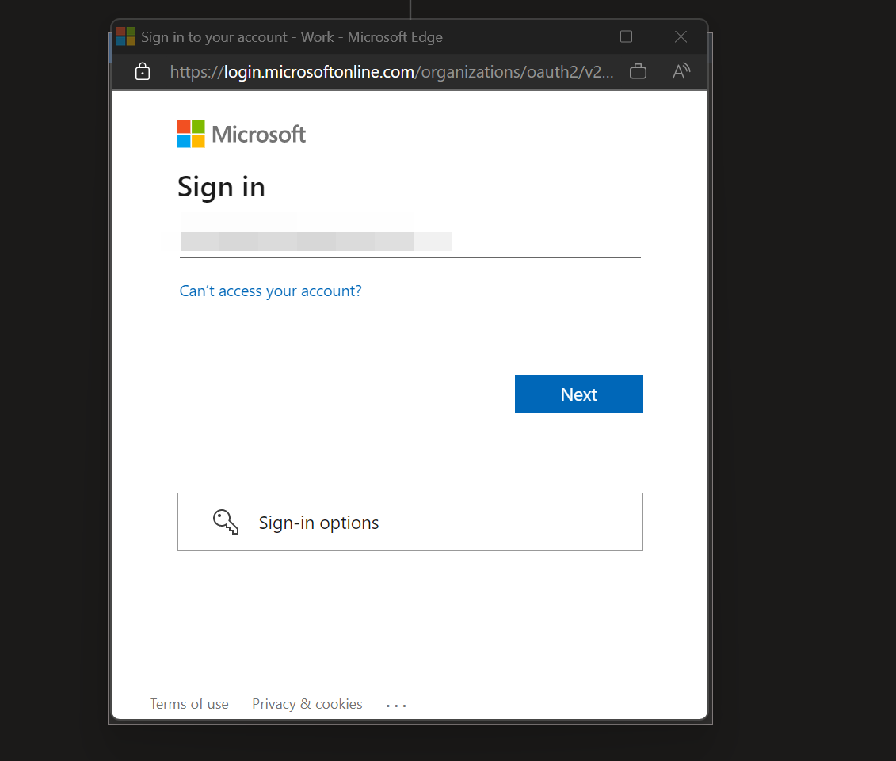

# Azure-AD-Disable-User

Para cualquier consulta técnica, por favor contacta a dfernandezm@onesec.mx

Este playbook está diseñado para ejecutarse desde un incidente de Microsoft Sentinel. Deshabilita las cuentas de usuario de Azure AD asociadas con las entidades de incidentes de Microsoft Sentinel. Este playbook se utiliza en conjunto con nuestro playbook [AS-Azure-AD-Enable-User](https://github.com/Azure/Azure-Sentinel/tree/master/Playbooks/AS-Azure-AD-Enable-User).

#
### Despliegue

Para configurar y desplegar este playbook:

1. Haz clic en el botón "**Desplegar en Azure**" ubicado abajo y te llevará a la plantilla de despliegue personalizada.

3. En la sección **Detalles del proyecto**:
   - Selecciona la **Suscripción** y el **Grupo de recursos** desde las cajas desplegables a las que te gustaría que se desplegara el playbook.

4. En la sección **Detalles de la instancia**:
   - **Nombre del Playbook**: Puede dejarse como "**AS-Azure-AD-Disable-User**" o puedes cambiarlo.

5. Hacia el fondo, haz clic en "**Revisar + crear**".

   

6. Una vez que los recursos hayan sido validados, haz clic en "**Crear**".

   

7. Los recursos tardarán aproximadamente un minuto en desplegarse. Una vez completado el despliegue, puedes expandir la sección "**Detalles del despliegue**" para verlos.
   Haz clic en el correspondiente a la Logic App.

   

8. Haz clic en el botón "**Editar**". Esto nos llevará al Diseñador de Logic Apps.

   

9. Antes de que se pueda ejecutar el playbook, la conexión de Azure AD deberá ser autorizada en el paso indicado, o se puede seleccionar una conexión autorizada existente. Esta conexión se encuentra bajo el tercer paso etiquetado como "**Para cada**".

   

10. Expande el paso de "**Conexiones**" y haz clic en el icono de signo de exclamación junto al nombre que coincide con el playbook.

    

11. Cuando se te solicite, inicia sesión para validar la conexión.

    

**Autor**: Adaptación a playbook creado por Accelerynt
