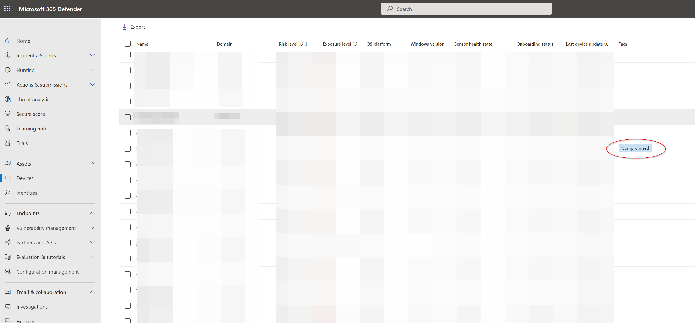
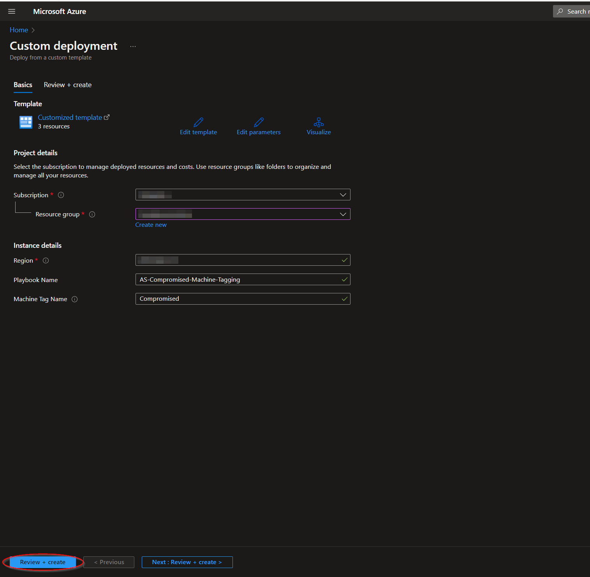
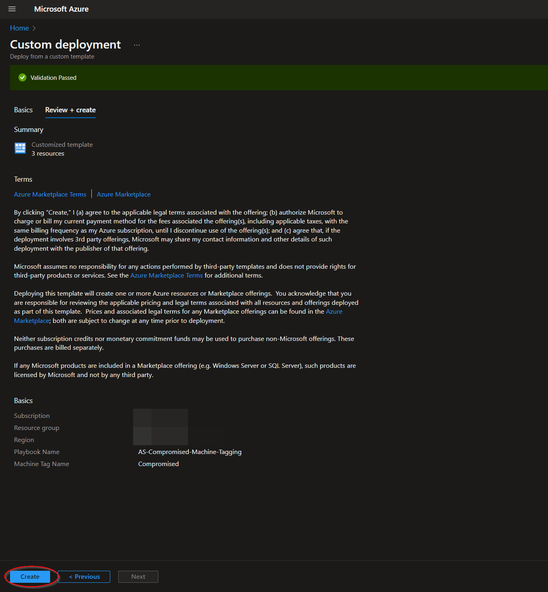
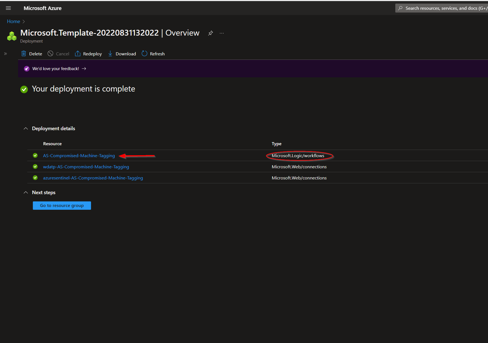
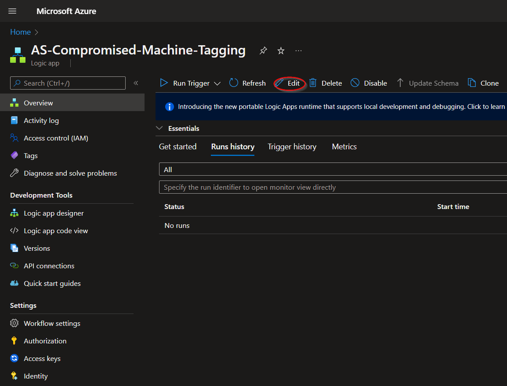
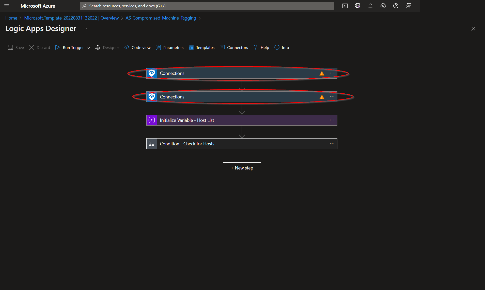
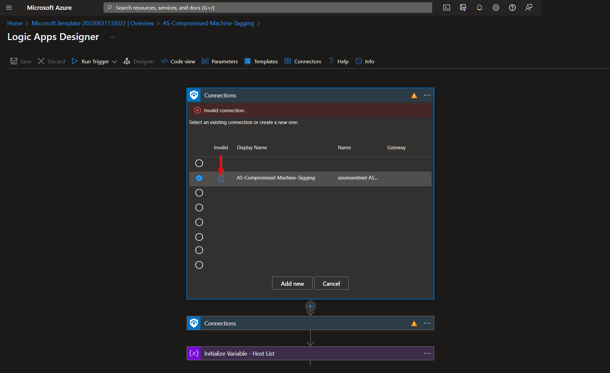
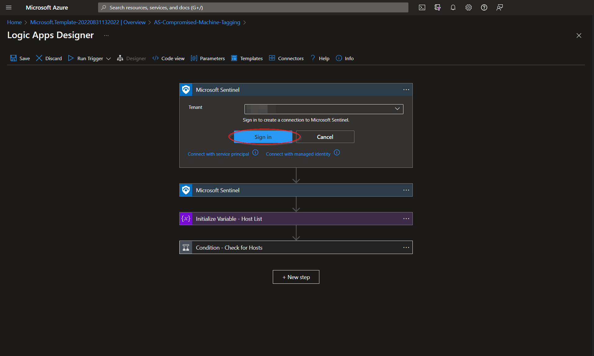
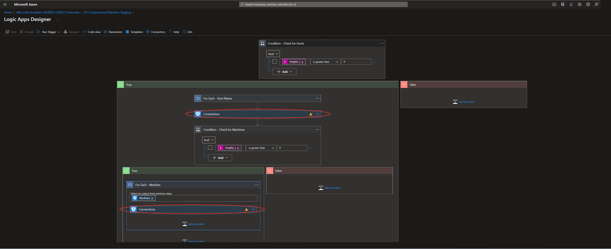
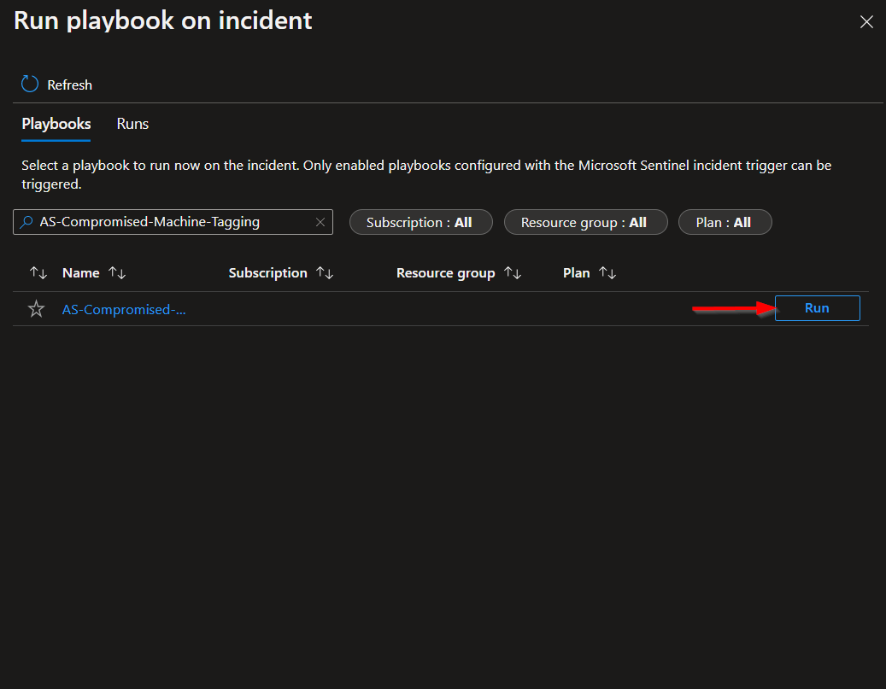

# AS-Compromised-Machine-Tagging

Para cualquier pregunta técnica, por favor contacta a dfernandezm@onesec.mx

Este playbook está diseñado para ejecutarse desde un incidente de Microsoft Sentinel. Coincide los hosts del incidente con dispositivos en Microsoft 365 Defender y etiqueta estas máquinas como "comprometidas" o con otra etiqueta de tu elección.

## Despliegue

Para configurar y desplegar este playbook:

Abre tu navegador y asegúrate de estar conectado a tu espacio de trabajo de Microsoft Sentinel. En una pestaña separada, abre el enlace a nuestro playbook en el Repositorio de Seguridad de Accelerynt:

[Accelerynt Security GitHub Repository](https://github.com/Accelerynt-Security/AS-Compromised-Machine-Tagging)

Haz clic en el botón "**Desplegar en Azure**" al final y te llevará a la plantilla de despliegue personalizada.

En la sección **Detalles del Proyecto**:

* Selecciona la **Suscripción** y el **Grupo de Recursos** de los cuadros desplegables donde desees que se despliegue el playbook.

En la sección **Detalles de la Instancia**:

* **Nombre del Playbook**: Esto puede dejarse como "**AS-Compromised-Machine-Tagging**" o puedes cambiarlo.

* **Nombre de la Etiqueta de la Máquina**: Esto puede dejarse como "**Comprometido**" o puedes cambiarlo.

Hacia el fondo, haz clic en "**Revisar + crear**".

Una vez que los recursos hayan sido validados, haz clic en "**Crear**".

Los recursos deberían tardar alrededor de un minuto en desplegarse. Una vez completado el despliegue, puedes expandir la sección "**Detalles del Despliegue**" para verlos.

Haz clic en el correspondiente a la Logic App.

Haz clic en el botón "**Editar**". Esto te llevará al Diseñador de Logic Apps.

Los primeros y segundos pasos etiquetados como "**Conexiones**" utilizan una conexión azuresentinel compartida creada durante el despliegue de este playbook. Antes de que el playbook pueda ejecutarse, esta conexión necesitará ser autorizada, o se puede seleccionar alternativamente una conexión autorizada existente para cada una.

Para validar la conexión azuresentinel creada para este playbook, expande cualquiera de los pasos "**Conexiones**" y haz clic en el icono de punto de exclamación al lado del nombre que coincide con el playbook.

Cuando se te solicite, inicia sesión para validar la conexión.

Dado que los primeros dos pasos comparten la misma conexión, no es necesario repetir el proceso aquí. Simplemente actualiza la página para asegurarte de que los primeros dos pasos ahora tienen conexiones válidas.

Este proceso necesitará ser repetido para las dos conexiones wdatp, responsables de comunicarse con Microsoft Defender. Expande el paso etiquetado "**Condición - Verificar Hosts**"

Repite el mismo proceso anterior para la conexión utilizada en los pasos indicados.

## Ejecución del Playbook

Para ejecutar este playbook desde un incidente de Microsoft Sentinel, navega a Microsoft Sentinel:

[Microsoft Sentinel](https://portal.azure.com/#view/HubsExtension/BrowseResource/resourceType/microsoft.securityinsightsarg%2Fsentinel)

Selecciona un espacio de trabajo y luego haz clic en la opción de menú "**Incidentes**" ubicada bajo "**Gestión de amenazas**". Selecciona un incidente con entidades de host comprometidas.

Haz clic en el botón de lista de "**Acciones**" en la parte inferior derecha de la pantalla y selecciona "**Ejecutar playbook**".

Desde la vista "**Ejecutar playbook en incidente**", escribe "**AS-Compromised-Machine-Tagging**" en la barra de búsqueda, luego haz clic en ejecutar.

**Autor**: Contenido adaptado de Accelerynt