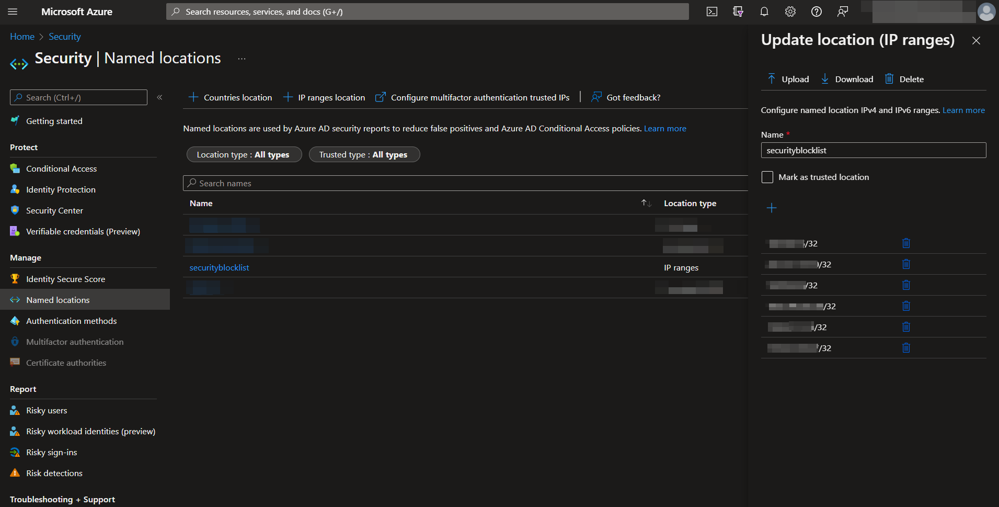
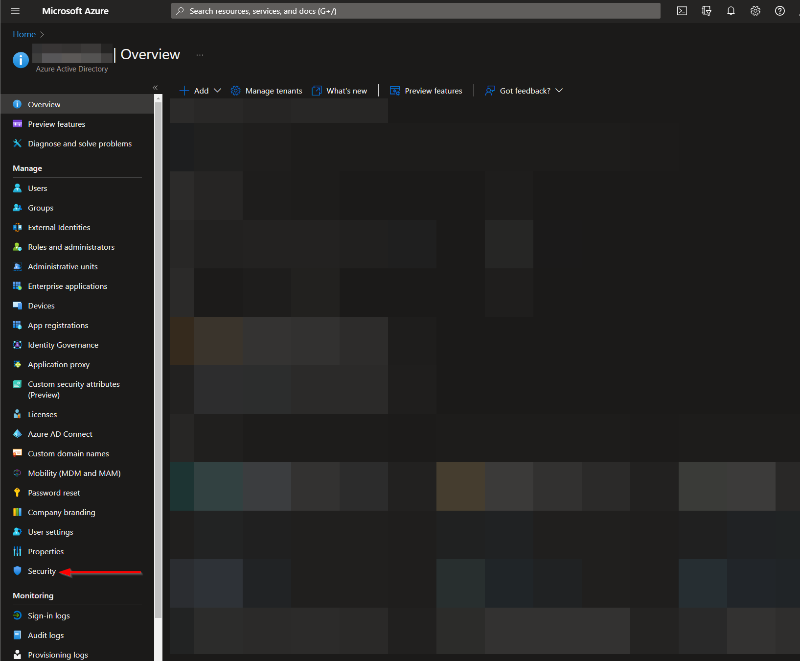

# AS-IP-Blocklist

**Autor**: Accelerynt

Para cualquier pregunta técnica, por favor contacta a info@accelerynt.com  

Este playbook está diseñado para ejecutarse desde un incidente de Microsoft Sentinel. Agrega la dirección IP de los incidentes de Microsoft Sentinel a una lista de ubicaciones nombradas en el Acceso Condicional de Microsoft Azure, indicando direcciones IP comprometidas.

## Requisitos

Los siguientes elementos son requeridos bajo la configuración de la plantilla durante el despliegue:

* Una lista de [Ubicaciones Nombradas](https://github.com/Azure/Azure-Sentinel/tree/master/Playbooks/AS-IP-Blocklist#create-a-named-locations-list) en Microsoft Azure.
* Un [Registro de Aplicación](https://github.com/Azure/Azure-Sentinel/tree/master/Playbooks/AS-IP-Blocklist#create-an-app-registration) para usar la API de Microsoft Graph.
* Un [Secreto en Azure Key Vault](https://github.com/Azure/Azure-Sentinel/tree/master/Playbooks/AS-IP-Blocklist#create-an-azure-key-vault-secret) que contenga tu Secreto de Registro de Aplicación.

## Configuración

#### Crear una lista de Ubicaciones Nombradas:

Navega al menú de Microsoft Azure Active Directory:

https://portal.azure.com/#view/Microsoft_AAD_IAM/ActiveDirectoryMenuBlade/~/Overview

Desde allí, haz clic en la opción de menú "**Seguridad**".

Navega a la opción de menú "**Ubicaciones nombradas**" y luego haz clic en "**Ubicación de rangos IP**".

Crea un nombre para tu lista de Ubicaciones Nombradas. La lista no se puede guardar sin un valor inicial. Se debe notar que las IPs solo son aceptadas en notación de rango CIDR. Las IPs individuales procesadas por este playbook tendrán un "**/32**" añadido para ajustarse a este formato.

El nombre de tu lista de Ubicaciones Nombradas, junto con su ID, deben ser anotados, ya que serán requeridos para el despliegue de este playbook.

El ID de la lista puede ser más difícil de localizar, ya que actualmente no se muestra en la URL al seleccionarla. Nuestra solución para esto fue enviar una solicitud GET desde https://developer.microsoft.com/en-us/graph/graph-explorer al siguiente endpoint: https://graph.microsoft.com/v1.0/identity/conditionalAccess/namedLocations.

El cuerpo de respuesta JSON incluye todas las listas de Ubicaciones Nombradas, junto con sus IDs.

#### Crear un Registro de Aplicación:

Navega a la página de Registros de Aplicación de Microsoft Azure Active Directory:

https://portal.azure.com/#view/Microsoft_AAD_RegisteredApps/ApplicationsListBlade

Desde allí, haz clic en "**Nuevo registro**".

Selecciona un nombre para tu Registro de Aplicación, como "**AS-IP-Blocklist**", y luego haz clic en "**Registrar**".

Desde la hoja de menú de la aplicación, selecciona "**Permisos de API**" y luego haz clic en "**Agregar un permiso**". Haz clic en la categoría "**Microsoft Graph**".

Bajo "**Permisos de aplicación**", busca "**Policy**", selecciona las casillas "**Policy.Read.All**" y "**Policy.ReadWrite.ConditionalAccess**". Haz clic en "**Agregar permisos**".

Para que estos permisos se apliquen, también debe concederse el consentimiento administrativo. Haz clic en el botón "**Conceder consentimiento administrativo**" en la página "**Permisos de API**".

Regresa a la sección "**Información general**" en el menú y toma nota del "**ID de aplicación (cliente)**" y del "**ID de directorio (inquilino)**", ya que cada uno será necesario para el despliegue de este playbook. Haz clic en "**Agregar un certificado o secreto**".

Haz clic en "**Nuevo secreto de cliente**". Después de añadir una descripción y seleccionar una fecha de expiración, haz clic en "**Agregar**".

Copia el "**Valor**" generado y guárdalo para el siguiente paso, [Crear un Secreto en Azure Key Vault](https://github.com/Azure/Azure-Sentinel/tree/master/Playbooks/AS-IP-Blocklist#create-an-azure-key-vault-secret).

#### Crear un Secreto en Azure Key Vault:

Navega a la página de Azure Key Vaults: https://portal.azure.com/#view/HubsExtension/BrowseResource/resourceType/Microsoft.KeyVault%2Fvaults

Navega a un Key Vault existente o crea uno nuevo. Desde la página de visión general del Key Vault, haz clic en la opción de menú "**Secretos**", encontrada bajo la sección "**Configuración**". Haz clic en "**Generar/Importar**".

Elige un nombre para el secreto, como "**AS-IP-Blocklist-App-Registration-Secret**", e introduce el Secreto de Registro de Aplicación copiado previamente en el campo "**Valor**". Todas las demás configuraciones pueden dejarse como están. Haz clic en "**Crear**".

Una vez que tu secreto haya sido añadido al vault, navega a la opción de menú "**Políticas de acceso**", también encontrada bajo la sección "**Configuración**" en el menú de la página del Key Vault. Deja esta página abierta, ya que necesitarás regresar a ella una vez que el playbook haya sido desplegado. Mira [Conceder Acceso al Key Vault de Azure](https://github.com/Azure/Azure-Sentinel/tree/master/Playbooks/AS-IP-Blocklist#granting-access-to-azure-key-vault).

