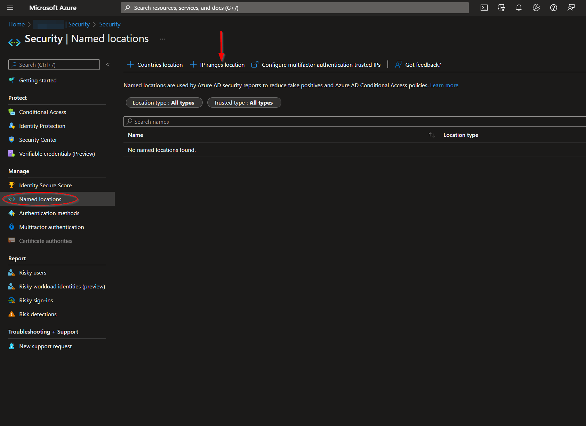
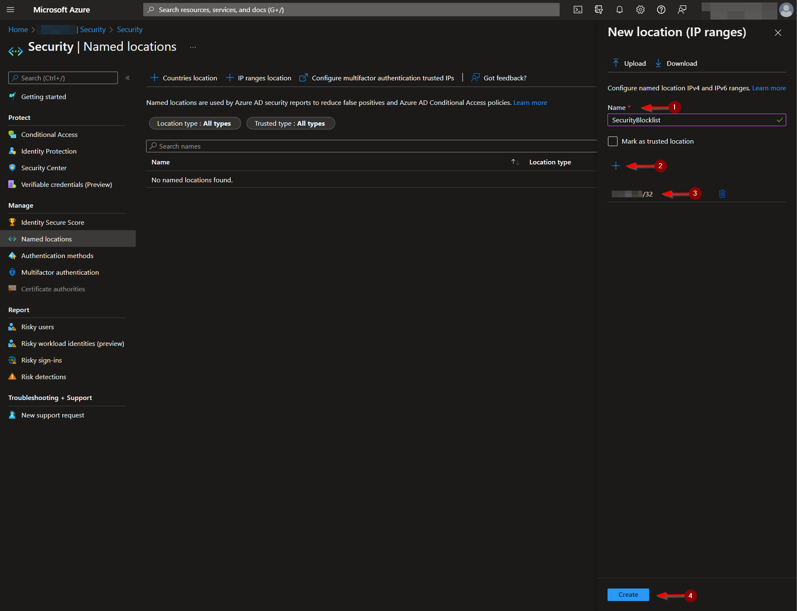
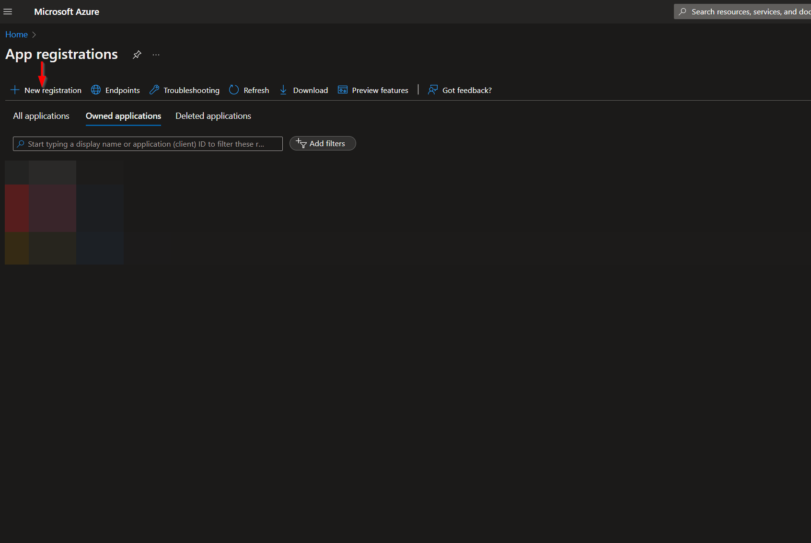
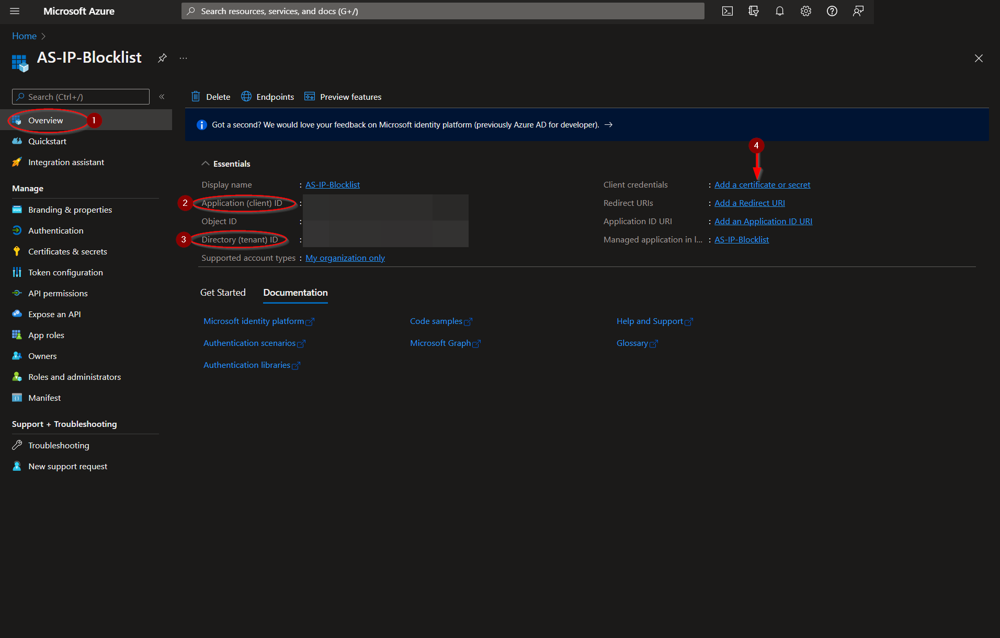
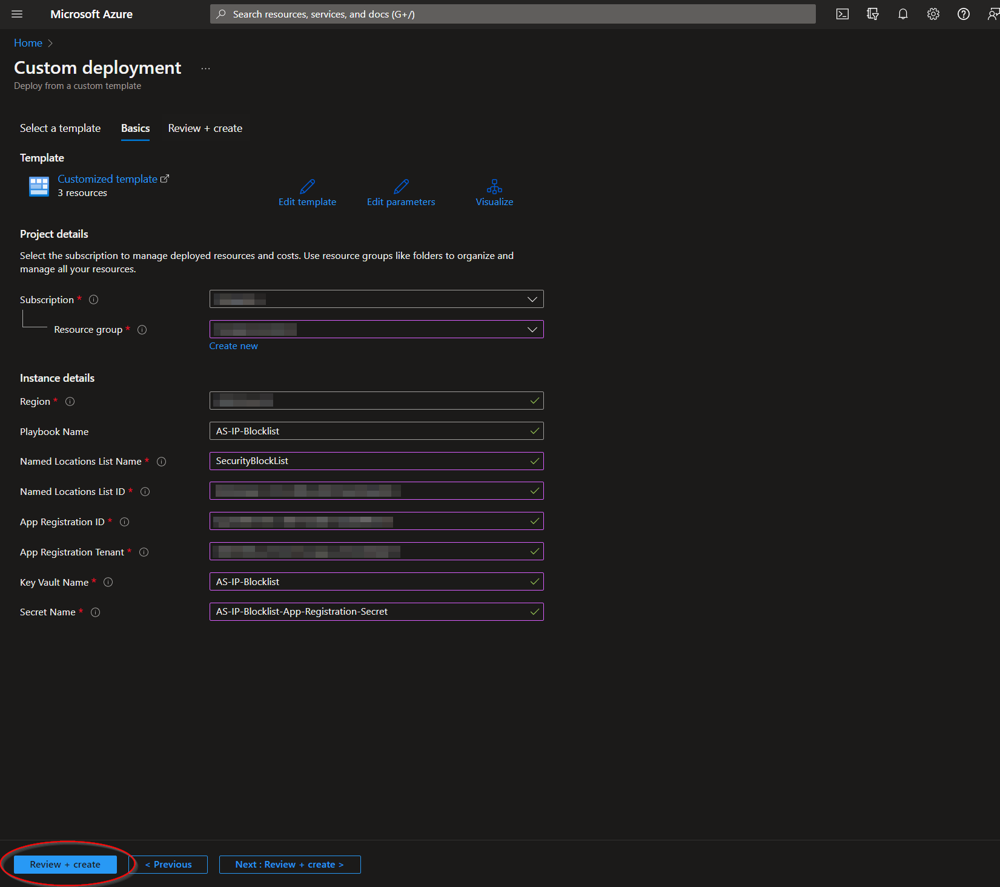
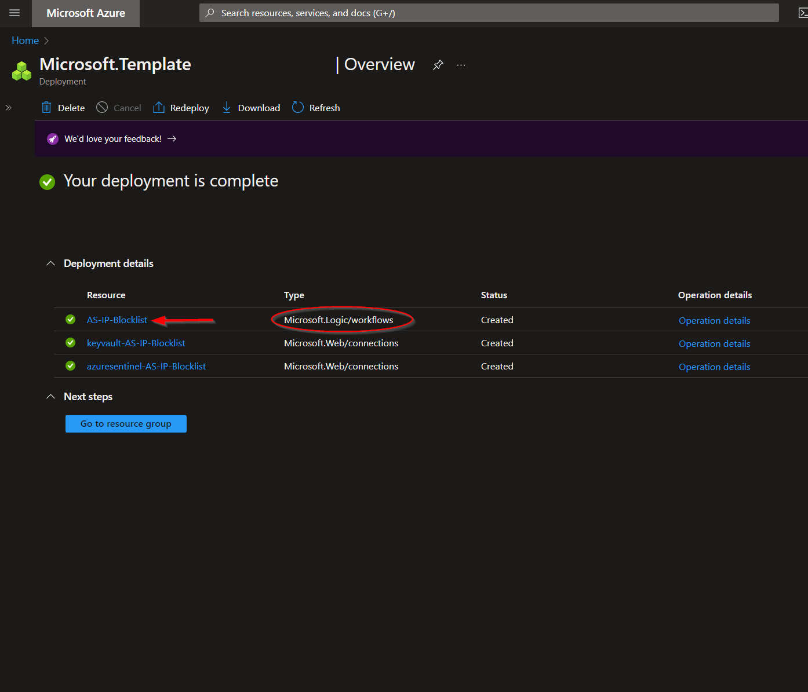

# AS-IP-Blocklist

En caso de presentar alguna duda, por favor, ponerse en contacto con dfernandezm@onesec.mx

Este playbook está diseñado para ejecutarse desde un incidente de Microsoft Sentinel. Añadirá la dirección IP de los incidentes de Microsoft Sentinel a una lista de Ubicaciones Nombradas de Acceso Condicional de Microsoft Azure, indicando direcciones IP comprometidas.

### Requisitos

* Lista de ubicaciones con nombre de Microsoft Azure [Named Locations List](https://github.com/Azure/Azure-Sentinel/tree/master/Playbooks/AS-IP-Blocklist#create-a-named-locations-list)
* Un registro de aplicación [App Registration](https://github.com/Azure/Azure-Sentinel/tree/master/Playbooks/AS-IP-Blocklist#create-an-app-registration) para utilizar la API de Microsoft Graph
* Un secreto de Azure Key Vault [Azure Key Vault Secret](https://github.com/Azure/Azure-Sentinel/tree/master/Playbooks/AS-IP-Blocklist#create-an-azure-key-vault-secret) que contiene el secreto de registro de su aplicación

### Configuración 

Crear una lista de ubicaciones con nombre:
Vaya al menú de Entra ID:

https://portal.azure.com/#view/Microsoft_AAD_IAM/ActiveDirectoryMenuBlade/~/Overview

Desde allí, haga clic en la opción de menú "**Security**" .

Vaya a la opción de menú "**Named locations**" y luego haga clic en "**IP ranges location**".

Cree un nombre para su lista de ubicaciones con nombre. La lista no se puede guardar sin un valor inicial. Se debe tener en cuenta que las direcciones IP solo se aceptan en una notación de rango CIDR. Las direcciones IP individuales procesadas por este manual tendrán un " /32 " adjunto para adaptarse a este formato.

Se debe tener en cuenta el nombre de su lista de ubicaciones nombradas, junto con su ID, ya que serán necesarios para la implementación.

Puede resultar más difícil rastrear el ID de la lista, ya que actualmente no se muestra en la URL al seleccionarla. La solución para esto fue enviar una solicitud GET desde https://developer.microsoft.com/en-us/graph/graph-explorer al siguiente punto de conexión: https://graph.microsoft.com/v1.0/identity/conditionalAccess/namedLocations .

El cuerpo de la respuesta JSON incluye todas las listas de ubicaciones nombradas, junto con sus ID.

#### Crear un registro de aplicación:
Vaya a la página Navegar a los registros de aplicaciones de Microsoft Azure Active Directory:

https://portal.azure.com/#view/Microsoft_AAD_RegisteredApps/ApplicationsListBlade

Desde allí, haga clic en "**New registration**".

Seleccione un nombre para el registro de su aplicación, como "**AS-IP-Blocklist**", luego haga clic en "**Register**".

En la hoja del menú de la aplicación, seleccione "**API permissions**" y, a continuación, haga clic en "**Add a permission**". Haga clic en la categoría "**Microsoft Graph**".

En " Permisos de la aplicación ", busque " Política " y, a continuación, seleccione las casillas de verificación "**Policy.Read.All**" y ""**Policy.ReadWrite.ConditionalAccess**". Haga clic en "**Add permissions**"

Para que se apliquen estos permisos, también se debe otorgar el consentimiento del administrador. Haga clic en el botón "**Grant admin consent**" indicado en la página "**API permissions**". 

Regrese a la sección "**Overview**" en el menú y tome nota del "**Application (client) ID**" y del "**Directory (tenant) ID** , ya que cada uno será necesario para la implementación de este manual. Haga clic en "**Add a certificate or secret**".

Haga clic en "**New client secret"**". Después de agregar una descripción y seleccionar una fecha de vencimiento, haga clic en "**Add**".

Copie el "**Value**" generado y guárdelo para el siguiente paso,  [Create an Azure Key Vault Secret](https://github.com/Azure/Azure-Sentinel/tree/master/Playbooks/AS-IP-Blocklist#create-an-azure-key-vault-secret).

#### Crear un secreto de Azure Key Vault:
Vaya a la página de Azure Key Vaults: https://portal.azure.com/#view/HubsExtension/BrowseResource/resourceType/Microsoft.KeyVault%2Fvaults

Navegue hasta un Key Vault existente o cree uno nuevo. Desde la página de descripción general de Key Vault, haga clic en la opción de menú "**Secrets**", que se encuentra en la sección "**Settings**". Haga clic en "**Generate/Import**".

Elija un nombre para el secreto, como " AS-IP-Blocklist-App-Registration-Secret ", e ingrese el secreto de registro de la aplicación copiado anteriormente en el campo "**Value**". El resto de las configuraciones se pueden dejar como están. Haga clic en  "**Create**".

Una vez que se haya agregado el secreto al almacén, navegue hasta la opción de menú "**Access policies**", que también se encuentra en la sección "**Settings**" del menú de la página Key Vault. Deje esta página abierta, ya que deberá regresar a ella una vez que se haya implementado el manual de estrategias. Consulte [Granting Access to Azure Key Vault](https://github.com/Azure/Azure-Sentinel/tree/master/Playbooks/AS-IP-Blocklist#granting-access-to-azure-key-vault).

### Despliegue

Implementar en Azure 

Haga clic en el botón “ Implementar en Azure ” en la parte inferior y lo llevará a la plantilla de implementación personalizada.

En la sección **Project Details** :

Seleccione la “**Subscription**” y el “**Resource Group**” de los cuadros desplegables en los que desea que se implemente el manual.
En la sección **Instance Details** :

**Playbook Name** : puede dejarlo como "**AS-IP-Blocklist**" o puede cambiarlo.

**Named Locations List Name** : Ingrese el valor de la lista de ubicaciones con nombre creada en [Create a Named Locations list](https://github.com/Azure/Azure-Sentinel/tree/master/Playbooks/AS-IP-Blocklist#create-a-named-locations-list).

 **Named Locations List ID** : ingrese el valor del ID de lista de ubicaciones con nombre al que se hace referencia en [Create a Named Locations list](https://github.com/Azure/Azure-Sentinel/tree/master/Playbooks/AS-IP-Blocklist#create-a-named-locations-list) .

 **App Registration ID**: ingrese el valor del ID de la aplicación (cliente) al que se hace referencia en [Create an App Registration](https://github.com/Azure/Azure-Sentinel/tree/master/Playbooks/AS-IP-Blocklist#create-an-app-registration).

**App Registration Tenant**: ingrese el valor del ID del directorio (inquilino) al que se hace referencia en  [Create an App Registration](https://github.com/Azure/Azure-Sentinel/tree/master/Playbooks/AS-IP-Blocklist#create-an-app-registration).

**Key Vault Name** : ingrese el nombre del Key Vault al que se hace referencia en [Create an Azure Key Vault Secret](https://github.com/Azure/Azure-Sentinel/tree/master/Playbooks/AS-IP-Blocklist#create-an-azure-key-vault-secret).

**Secret Name** : ingrese el nombre del secreto de Key Vault creado en [Create an Azure Key Vault Secret](https://github.com/Azure/Azure-Sentinel/tree/master/Playbooks/AS-IP-Blocklist#create-an-azure-key-vault-secret).

Hacia la parte inferior, haga clic en “**Review + create**”. 

Una vez validados los recursos, haga clic en "**Create**".

Los recursos deberían tardar alrededor de un minuto en implementarse. Una vez que se complete la implementación, puede expandir la sección  "**Deployment details**" para verlos. Haga clic en el que corresponda a la aplicación lógica.

Haga clic en el botón “**Edit**”. Esto nos llevará al Diseñador de aplicaciones lógicas.

Los pasos primero, segundo y sexto denominados  "**Connections**" utilizan conexiones creadas durante la implementación de este manual. Antes de poder ejecutar el manual, será necesario autorizar estas conexiones en los pasos indicados o, alternativamente, se pueden seleccionar las conexiones autorizadas existentes.

Para validar las conexiones creadas para este libro de estrategias, expanda el paso  "**Connections**" y haga clic en el ícono de signo de exclamación junto al nombre que coincide con el libro de estrategias.

Cuando se le solicite, inicie sesión para validar la conexión.

   

Una vez actualizados todos los pasos de conexión, haga clic en el botón  "**Save**".

  

#### Granting Access a Azure Key Vault
Antes de que la aplicación lógica pueda ejecutarse correctamente, la conexión de Key Vault creada durante la implementación debe tener acceso a Key Vault que almacena el secreto de registro de la aplicación.

Desde la página "**Access policies**"  de Key Vault, haga clic en "**Add Access Policy**".

Seleccione la casilla de verificación "**Get**" en el campo de lista "**Secret permissions**". A continuación, haga clic en el texto azul "**None selected**" junto al campo "**Select principal**".

Pegue "**AS-IP-Blocklist**" en el cuadro de búsqueda principal y haga clic en la opción que aparece. Haga clic en **Select**" en la parte inferior de la página.

Haga clic en "**Add**".

