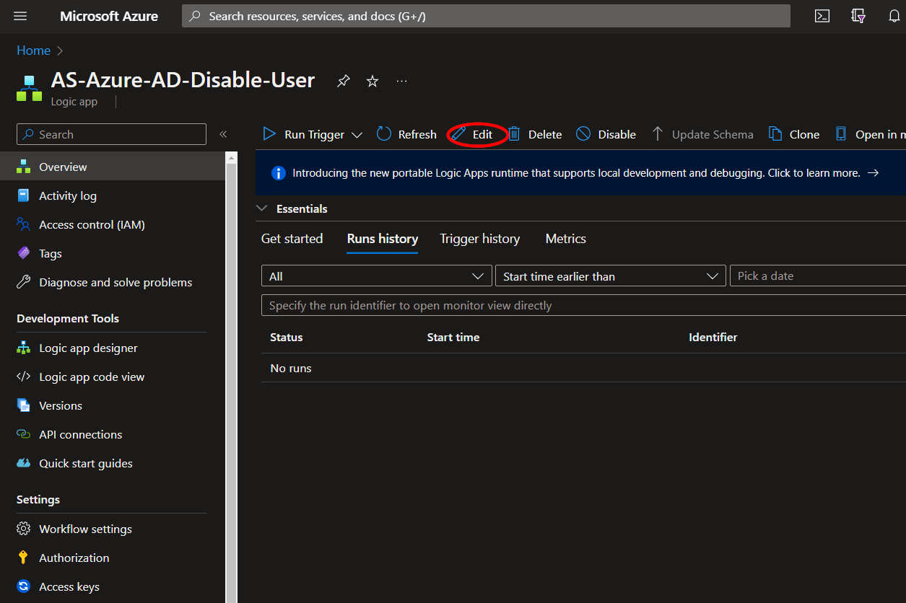
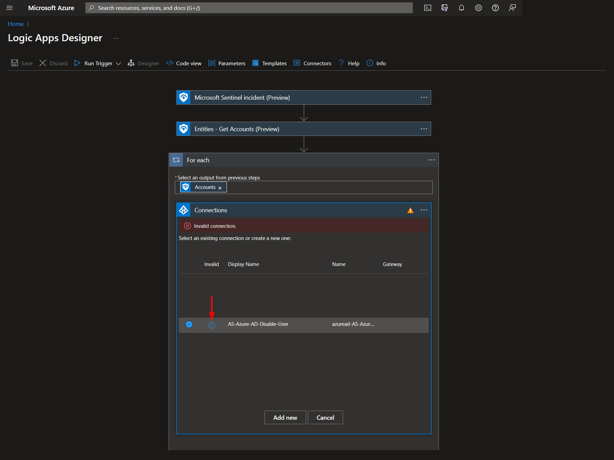

# Azure-AD-Disable-User

Para cualquier duda técnica consulte a dfernandezm@onesec.mx

This playbook está pensado para ejecutarse desde un incidente de Microsoft Sentinel. Deshabilitará las cuentas de usuario de Azure AD asociadas con las entidades de los incidentes de Microsoft Sentinel.

#
### Despliegue

Para configurar e implementar este manual:

Abra su navegador y asegúrese de haber iniciado sesión en su espacio de trabajo de Microsoft Sentinel

Haga clic en el botón “**Deploy to Azure**” en la parte inferior y lo llevará a la plantilla de implementación personalizada.

En la sección **Project details** :

* Elija la **Subscription** y **Resource group** de los cuadros desplegables  

En la sección **Instance details** :  
                                                  
* **Playbook Name**: puede dejarlo como "**AS-Azure-AD-Disable-User**" o puede cambiarlo. 

Hacia la parte inferior, haga clic en "**Review + create**". 

Una vez validados los recursos, haga clic en "**Create**".

Los recursos deberían tardar alrededor de un minuto en implementarse. Una vez que se complete la implementación, puede expandir la sección "**Deployment details**"  para verlos. Haga clic en el que corresponda a la logic app.

Haga clic en el botón "**Edit**" button.. Esto nos llevará al Diseñador de la logic app 

Antes de poder ejecutar el playbook, será necesario autorizar la conexión de Azure AD en el paso indicado o, alternativamente, se puede seleccionar una conexión autorizada existente. Esta conexión se puede encontrar en el tercer paso denominado "**For each**".

Expande el paso "**Connections**" y haz clic en el ícono del signo de exclamación junto al nombre que coincide con el playbook.
                                                                                                

Cuando se le solicite, inicie sesión para validar la conexión.                                                                                              

