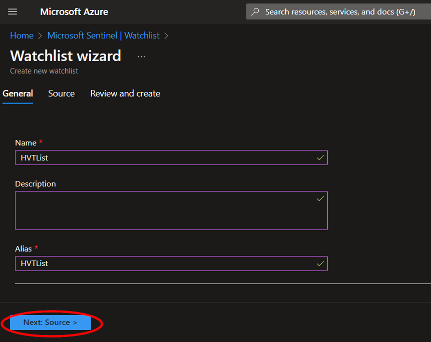
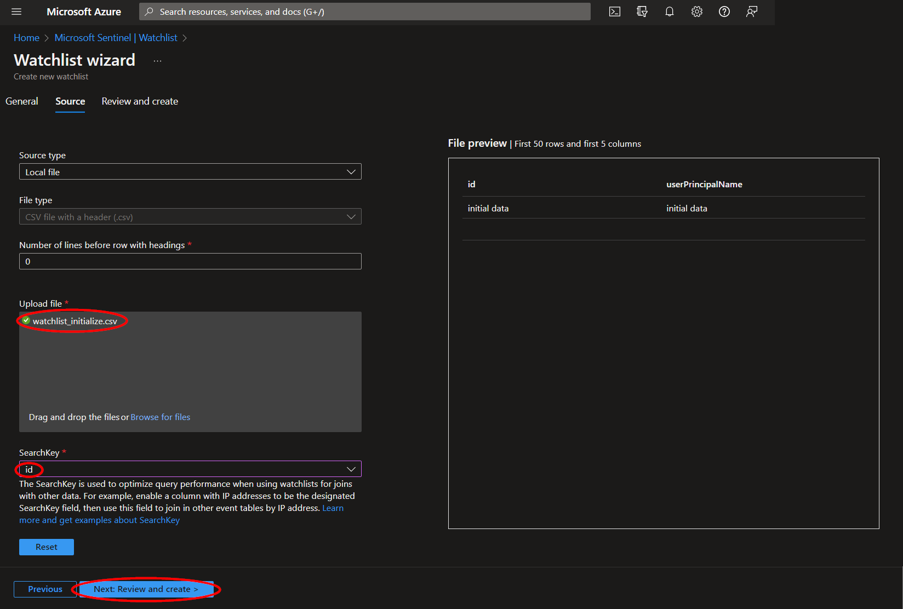
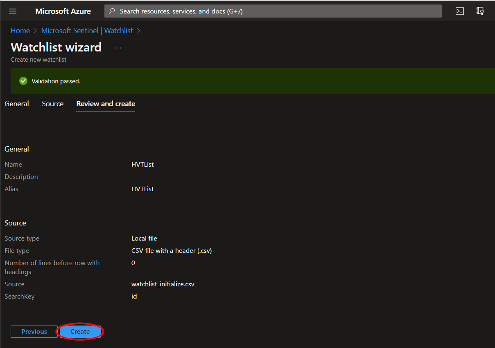
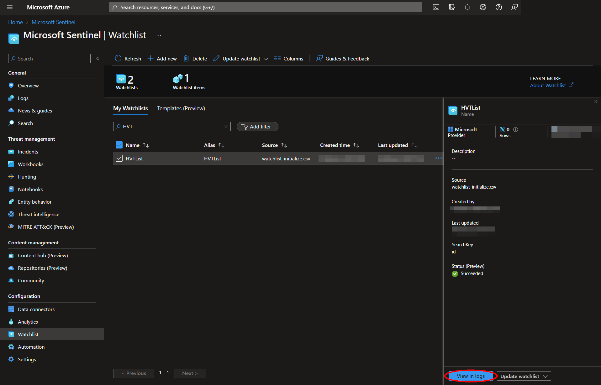
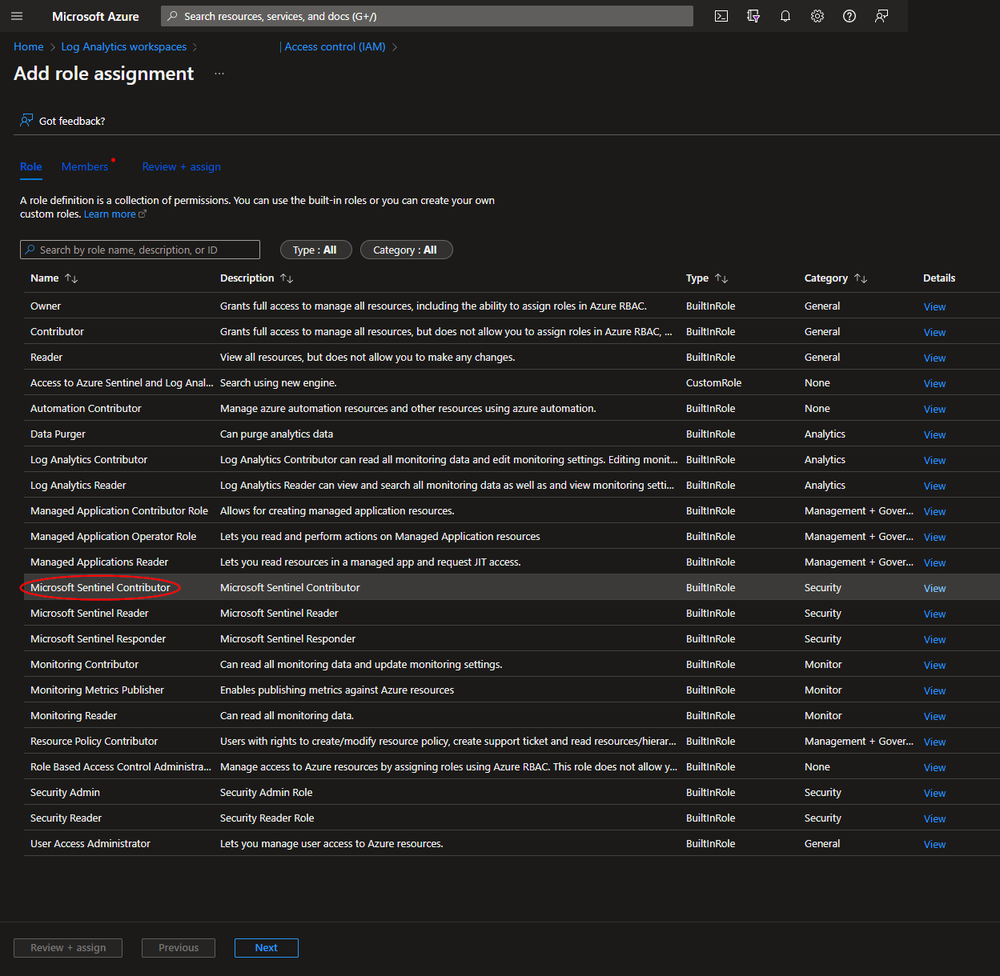

# AS-Import-Azure-AD-Group-Users-to-MS-Watchlist

Para cualquier consulta técnica, por favor contactar dfernandezm@onesec.one

Este playbook está diseñado para obtener las entidades de un incidente de Sentinel y agregarlo a una Watchlist.

#
### Requisitos

Los siguientes elementos son necesarios en la configuración de la plantilla durante la implementación:

* Un [Azure Active Directory group Id](https://github.com/Azure/Azure-Sentinel/tree/master/Playbooks/AS-Import-AD-Group-Users-to-MS-Watchlist#azure-active-directory-group-id)

* Un [Microsoft Sentinel watchlist](https://github.com/Azure/Azure-Sentinel/tree/master/Playbooks/AS-Import-AD-Group-Users-to-MS-Watchlist#create-a-microsoft-sentinel-watchlist)

* Un [Microsoft Sentinel workspace Id](https://github.com/Azure/Azure-Sentinel/tree/master/Playbooks/AS-Import-AD-Group-Users-to-MS-Watchlist#microsoft-sentinel-workspace-id)

#### Create a Microsoft Sentinel Watchlist:

Vaya a la página de Microsoft Sentinel y seleccione un workspace:

https://portal.azure.com/#view/HubsExtension/BrowseResource/resourceType/microsoft.securityinsightsarg%2Fsentinel

En la sección "**Configuration**"  del menú, haga clic en "**Watchlist**",  y luego haga clic en "**Add new**".

Complete los campos obligatorios y tome nota del valor que utiliza para "**Alias**" , ya que será necesario para la implementación. Luego haga clic en "**Next: Source**".

La lista de seguimiento no se puede crear sin los datos iniciales. Hemos creado un archivo con los encabezados necesarios y una entrada que se puede eliminar posteriormente de la lista de seguimiento una vez que se haya actualizado con entradas adicionales.

Sube el archivo "**watchlist_initialize.csv**"  incluido en este repositorio y selecciona "**id**" como clave de búsqueda. Luego haz clic en "**Next: Review and create**".

Revise la información y luego haga clic en "**Create**".

Una vez creada su lista de seguimiento, puede ver las entradas haciendo clic en el nombre de la lista de seguimiento en la página "**Overview**"  y luego haciendo clic en "**View in logs**".

Esto ejecutará una consulta de Kusto para su lista de seguimiento y debería poder ver los datos de inicialización que se acaban de cargar. Tenga en cuenta que puede llevar un minuto después de la creación de su lista de seguimiento que la consulta muestre los resultados.

#### Microsoft Sentinel Workspace Id:

Vaya a la página de Microsoft Sentinel y seleccione el mismo espacio de trabajo que antes:

https://portal.azure.com/#view/HubsExtension/BrowseResource/resourceType/microsoft.securityinsightsarg%2Fsentinel

En la sección "**Configuration**" del menú, haga clic en "**Settings**"y luego en la pestaña "**Workspace settings**" 

Copy the value of the "**Workspace ID**" field and save it for deployment.

#
### Despliegue                                                                                                         
                                                                                                        
TPara configurar e implementar este manual:

Abra su navegador y asegúrese de haber iniciado sesión en el mismo espacio de trabajo de Microsoft Sentinel seleccionado anteriormente. 

Haga clic en el botón “**Deploy to Azure**” enn la parte inferior y lo llevará a la plantilla de implementación personalizada.
En la sección **Project Details**:

* Seleccione la “**Subscription**” y el “**Resource Group**” de los cuadros desplegables

En la sección **Instance Details**:   

* **Playbook Name**: puede dejarlo como "**AS-Import-AD-Group-Users-to-MS-Watchlist**" o puede cambiarlo.

* **Group Id**: ingrese el Id. del grupo de Azure Active Directory al que se hace referencia en [Azure Active Directory group Id](https://github.com/Azure/Azure-Sentinel/tree/master/Playbooks/AS-Import-AD-Group-Users-to-MS-Watchlist#azure-active-directory-group-id).

* **Watchlist Name**: el nombre de la lista de seguimiento a la que se hace referencia en [Create a Microsoft Sentinel Watchlist](https://github.com/Azure/Azure-Sentinel/tree/master/Playbooks/AS-Import-AD-Group-Users-to-MS-Watchlist#create-a-microsoft-sentinel-watchlist)

* **Workspace Id**: el Id. del espacio de trabajo de Microsoft Sentinel en el que se creó la lista de seguimiento, al que se hace referencia en el [Microsoft Sentinel workspace Id](https://github.com/Azure/Azure-Sentinel/tree/master/Playbooks/AS-Import-AD-Group-Users-to-MS-Watchlist#microsoft-sentinel-workspace-id)

Hacia la parte inferior, haga clic en “**Review + create**”. 

Una vez validados los recursos, haga clic en "**Create**".

Los recursos deberían tardar alrededor de un minuto en implementarse. Una vez que se complete la implementación, puede expandir la sección " Detalles de implementación " para verlos. Haga clic en el que corresponda a la aplicación lógica.

Haga clic en el botón “**Edit**” Esto nos llevará al Diseñador de aplicaciones lógicas.

Antes de que el libro de estrategias pueda ejecutarse correctamente, será necesario autorizar  la conexión de Microsoft Sentinel utilizada en el cuarto y noveno paso, o se pueden seleccionar alternativamente las conexiones autorizadas existentes.

Al regresar a la página "**Overview**" de la aplicación lógica, ahora se puede ejecutar correctamente.

# 
### Agregar función de colaborador de Microsoft Sentinel

Para ejecutarse correctamente, este manual requiere el rol de colaborador de Microsoft Sentinel en el espacio de trabajo de Log Analytics.

Vaya a la página Espacios de trabajo de Log Analytics y seleccione el mismo espacio de trabajo en el que se encuentra la lista de seguimiento:

https://portal.azure.com/#view/HubsExtension/BrowseResource/resourceType/Microsoft.OperationalInsights%2Fworkspaces

Seleccione la opción  "**Access control (IAM)**" del menú y luego haga clic en "**Add role assignment**".

Seleccione el rol "**Microsoft Sentinel Contributor**" y luego haga clic en "**Next**".

Seleccione la opción "**Managed identity**" y, luego, en la suscripción en la que se encuentra la aplicación lógica, establezca el valor de "**Managed identity**" en "**Logic app**".  A continuación, ingrese "**AS-Import-Azure-AD-Group-Users-to-MS-Watchlist**", o el nombre alternativo del playbook utilizado durante la implementación, en el campo etiquetado como  "**Select**". Seleccione el playbook y, luego, haga clic en "**Select**".

Continúe en la pestaña "**Review + assign**"  y haga clic en "**Review + assign**".

# 
### Edición de la lista de vigilancia de Microsoft Sentinel

Para crear una lista de seguimiento se necesitan datos iniciales. Por este motivo, la lista de seguimiento tendrá una fila con los valores " initial data ". Una vez que la aplicación lógica se haya ejecutado correctamente y se hayan agregado otras entradas, puede eliminar esta fila.

Para ello, vuelva a la página de Microsoft Sentinel:

https://portal.azure.com/#view/HubsExtension/BrowseResource/resourceType/microsoft.securityinsightsarg%2Fsentinel

Haga clic en el nombre del espacio de trabajo utilizado durante la implementación y luego haga clic en "**Watchlist**" en la sección "**Configuration**".

Haga clic en el nombre de la lista de seguimiento utilizada durante la implementación. Se abrirá un menú en el lado derecho de la página. Haga clic en  "**Update watchlist**".

Marque la casilla de la fila con los valores "**initial data**"  y haga clic en "**Delete**".

