# AS-MDE-Isolate-Machine

En caso de presentar alguna duda, por favor, ponerse en contacto con dfernandezm@onesec.mx

Este playbook está diseñadp para ejecutar un incidentee desde Microsoft Sentinel. Correlacionará los host de un incidente de Microsoft Sentinel con las máquinas en Microsoft Dedender y las aislará en cuarentena. Se añadirá un mensaje sobre el incidente indicando las máquinas afectadas. 
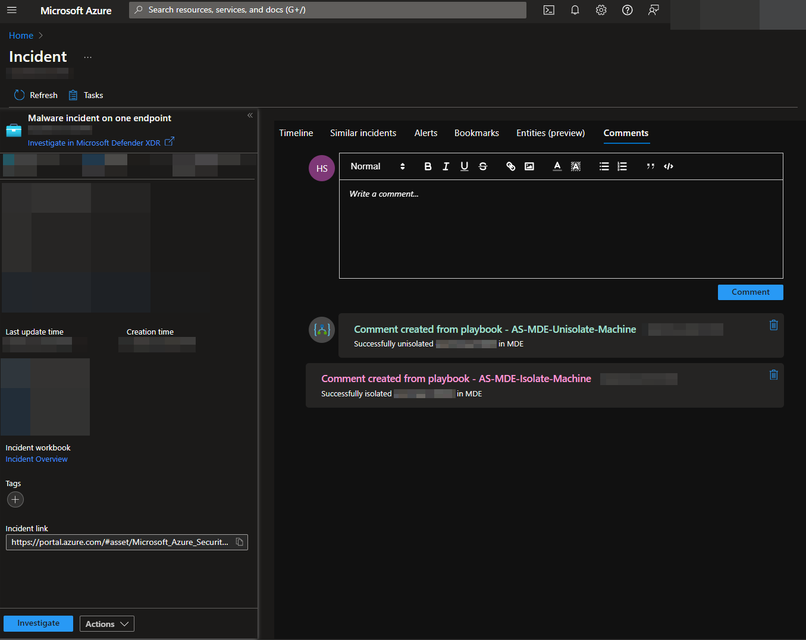

### Requisitos

* Tener un rol de grant admin para asignara permisos a la aplicación que se creará más adelante.
* Acceso como Key Vault Administrator para crear y configurar un cliente secreto. 

### Configuración 

Navegue hasta Entra ID registro de aplicaciones:
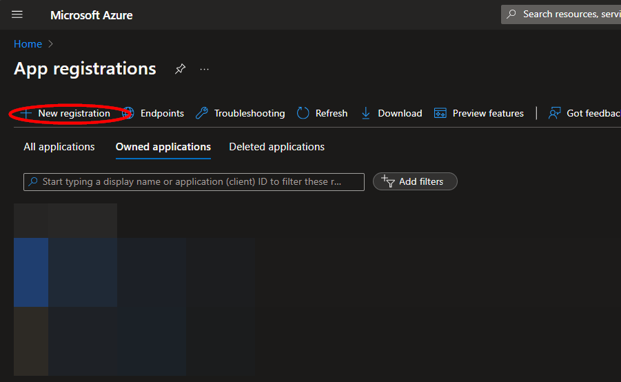

Ingrese el nombre **AS-MDE-Isolate-Machine**" y dele click en registrar:

Una vez que la aplicación se haya registriado, puede dirigirse a la página de "**Overview**". Dejabo de la sección "**Essentials**" , tome nota de "**Application (client) ID**", ya que se necesitará para el despliegue. 

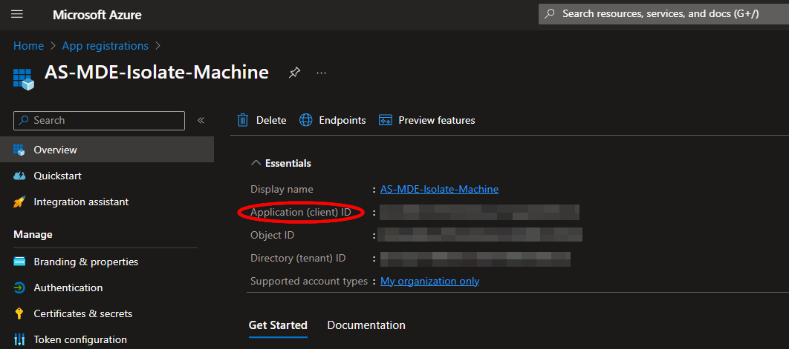

Luego, puedes agregar permisos en el registro de la aplicación. [Microsoft Defender Isolate machine endpoint](https://learn.microsoft.com/en-us/microsoft-365/security/defender-endpoint/api/isolate-machine?view=o365-worldwide#http-request). Desde el menú lateral, de click en "**API permissions**", debajo de la sección "**Manage**". Después, haga click en  "**Add a permission**".
Desde el panel de   "**Select an API**", haga click en "**APIs my organization uses**", luego busque "**WindowsDefenderATP**" y agregue la opción. 

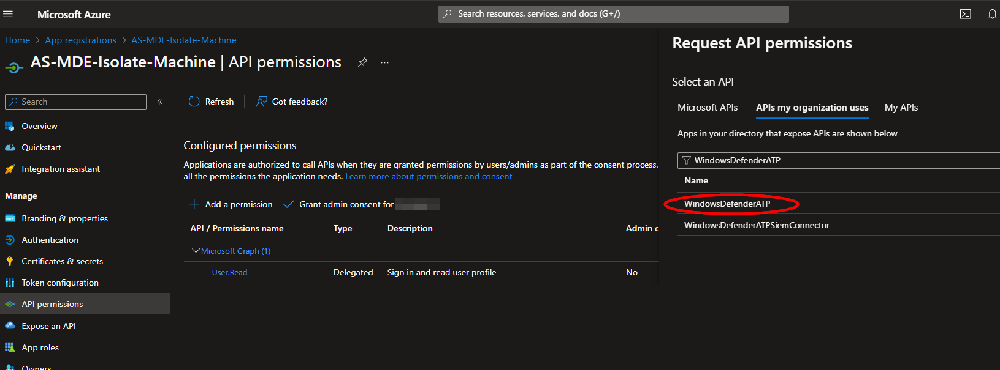

Ingrese en "**Application permissions**" y busque "**Machine.Isolate**". Luego, haga click en "**Add permissions**".

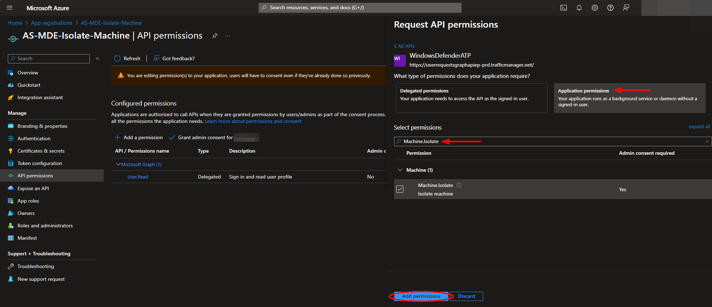

Asigue el consentimiento del permiso asignado a través de "**Grant admin consent for (name)**".

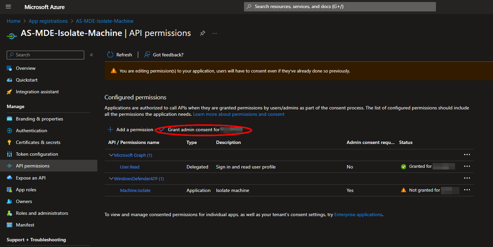

En seguida, genere un cliente secreto. Desde el menú izquierdo, haga click en  "**Certificates & secrets**", debajo de la sección "**Manage**". Luego, haga click en "**New client secret**". Ingrese la información en la descripción y seleccione la temporalidad de la fecha de expiración y de click en "**Add**".
 

Copie el valor generado del secreto, luego lo necesitara para [Create an Azure Key Vault Secret](https://github.com/Azure/Azure-Sentinel/tree/master/Playbooks/AS-MDE-Isolate-Machine#create-an-azure-key-vault-secret).

#### Crear un  Azure Key Vault Secret
Navegue hasta la página de Azure Key Vaults 

https://portal.azure.com/#view/HubsExtension/BrowseResource/resourceType/Microsoft.KeyVault%2Fvaults

A continuación, creará un Key Vault o usará uno existente y en la opción del menú "**Secrets**", encontrará abajo la opción de "**Settings**". Haga click en "**Generate/Import**".

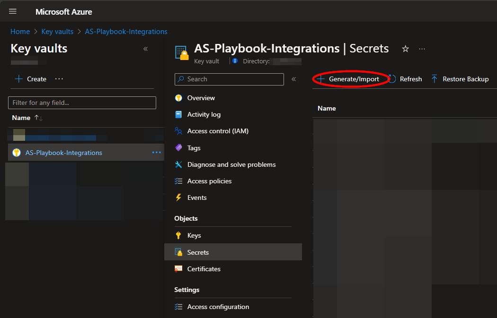

Escoja el nombre del secreto, como por ejemplo "**AS-MDE-Isolate-Machine--AR-Client-Secret**", e ingrese el secreto cliente copiándolo de [previous section](https://github.com/Azure/Azure-Sentinel/tree/master/Playbooks/AS-MDE-Isolate-Machine#create-an-app-registration). Luego de ver todas las configuraciones haga click en "**Create**". 

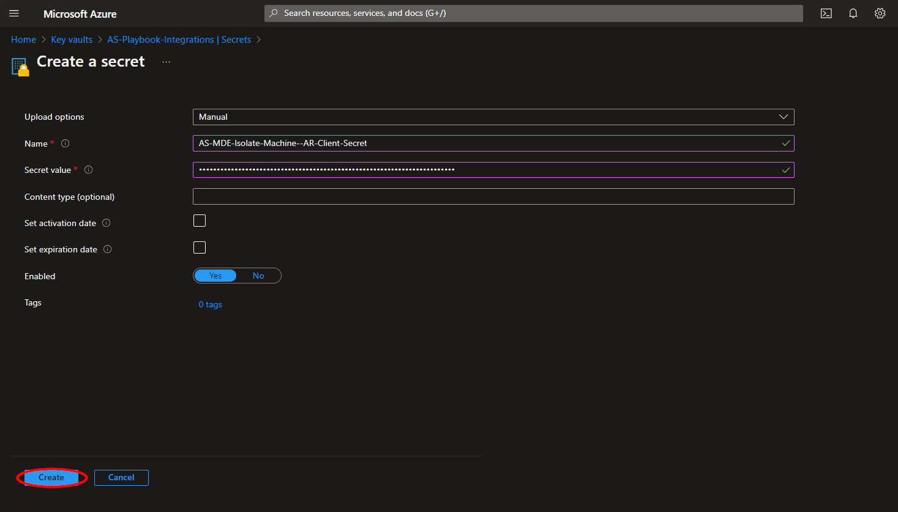

Una vez añadido el secreto en el baúl, navegue hasta "**Access policies**". Mantenga la pestaña abierta, ya que necesitará returnar más adelante, luego de desplegar el playbook. [Granting Access to Azure Key Vault](https://github.com/Azure/Azure-Sentinel/tree/master/Playbooks/AS-MDE-Isolate-Machine#granting-access-to-azure-key-vault).

### Despligue

Haga click en el siguiente botón 

En la sección de **Project Details**:

* Seleccione la subscripción y el grupo de recursos.

En la sección **Instance Details**

* **Playbook Name**: Puede dejar  "**AS-MDE-Isolate-Machine**" o si desea puede cambiarlo. 
*  **Client ID**: Ingrese el (client) ID de su aplicación referenciado anteriormentee [Create an App Registration](https://github.com/Azure/Azure-Sentinel/tree/master/Playbooks/AS-MDE-Isolate-Machine#create-an-app-registration).
* **Key Vault Name**: Ingrese el nombre del Key Vault Name mencionado en [Create an Azure Key Vault Secret](https://github.com/Azure/Azure-Sentinel/tree/master/Playbooks/AS-MDE-Isolate-Machine#create-an-azure-key-vault-secret).
* **Secret Name**: Ingrese el nombre del key vault Secret creado en [Create an Azure Key Vault Secret](https://github.com/Azure/Azure-Sentinel/tree/master/Playbooks/AS-MDE-Isolate-Machine#create-an-azure-key-vault-secret).
Revise de nuevo la información y de click en "**Review + create**"

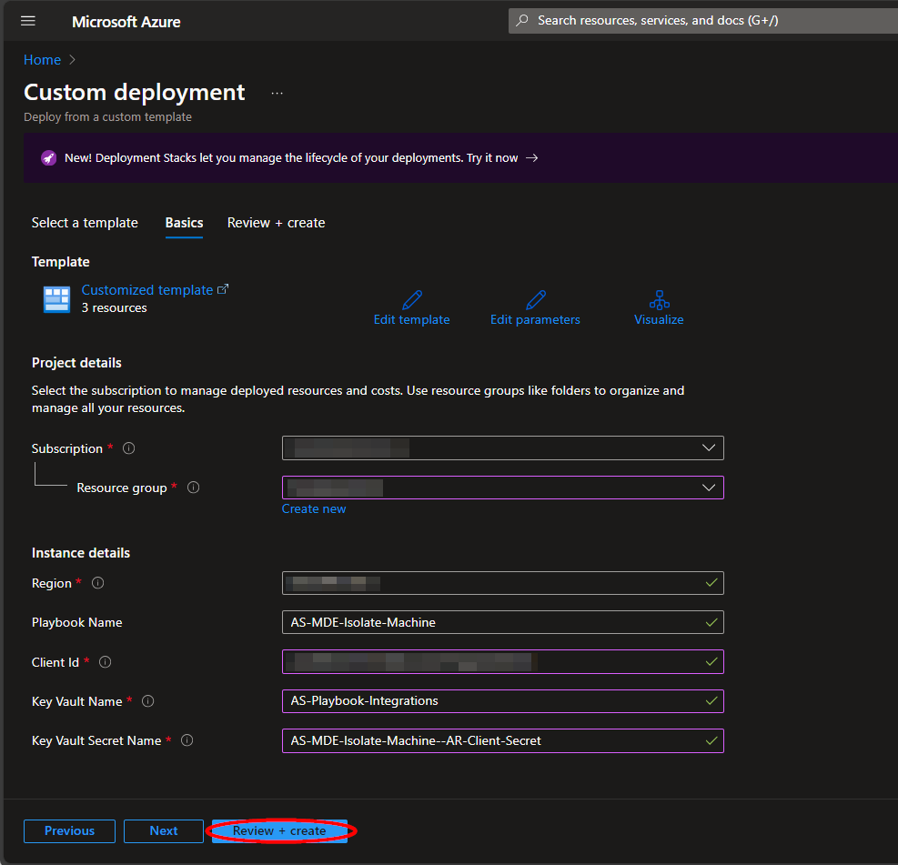

Una vez que el recursos fue validad, de click en "**Create**".

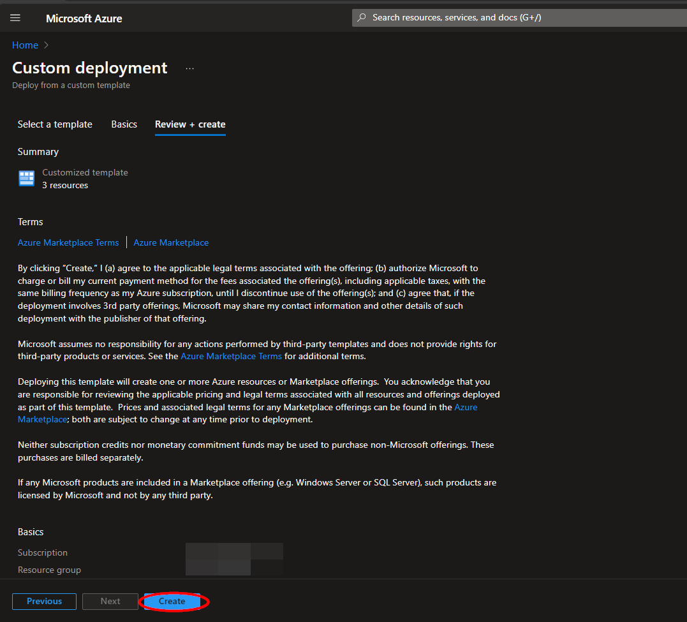

Los recursos puede que tomen al rededor de un minuto desplegando. Una vez que el despliegue está listo, expanda la información en "**Deployment details**" 

Haga click en su correspondiente Logic App. 
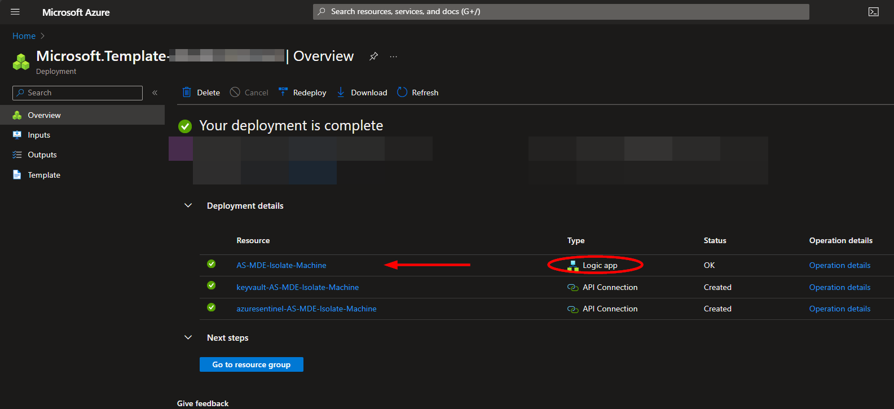

### Microsoft Sentinel Contributor Role
Abra otra pestaña en su navegador e ingrese al workspace de su Microsoft Sentinel. 
https://portal.azure.com/#view/HubsExtension/BrowseResource/resourceType/Microsoft.OperationalInsights%2Fworkspaces

Seleccione el  "**Access control (IAM)**" y haga click en "**Add role assignment**".
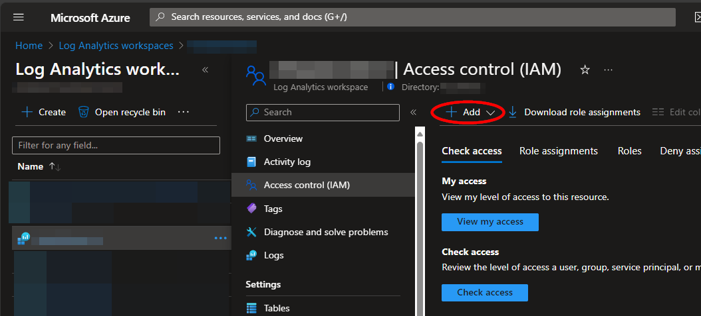

Seleccione el rol de "**Microsoft Sentinel Contributor**", luego haga click en  "**Next**".

Seleccione la opción de "**Managed identity**" y luego haga click en "**Select Members**". Debajo de la subscripción de la logic app seleccione "**Managed identity**" y escoja la logic app creada. 

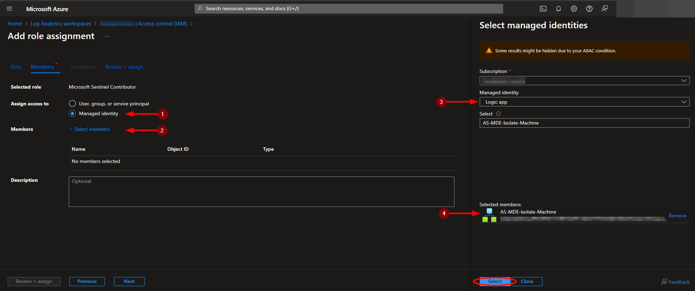

Continue y haga click en "**Review + assign**
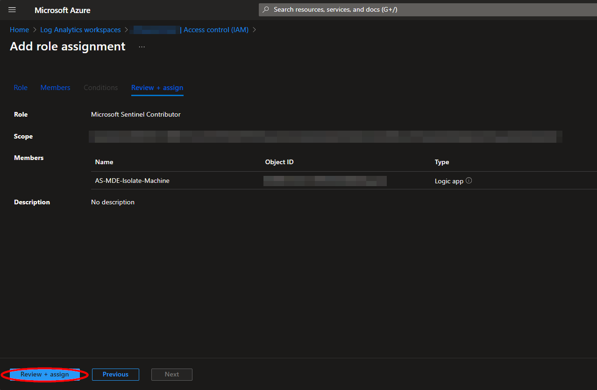

### Acceso a Azure Key Vault

Luego de que su Logic App despligue correctamente, se creará una conección al key vault creado, para lo cuál necesitará el acceso para tener acceso al registro de la aplicación. 

En el "**Access policies**" del key vault creado, haga click en "**Create**".

Seleccione el checkbox de "**Get**"  debajo de "**Secret permissions**", y haga click en "**Next**".

Pegue "**AS-MDE-Isolate-Machine** dentro del buscador y seleccione su logic app. 

Luego en la sección de "**Review + create**" , haga click en "**Create**".

